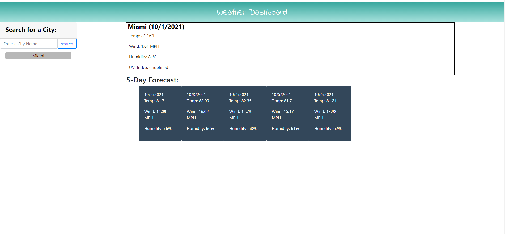

# Weather Dashboard
## Description
The purpose of this project was the create a weather dashboard using a third party API (openweathermap.org).  The user is able to view today's forecast for a city of their choice along with a five day future forecast.  This project utilizes html, css, javascript, jquery, moment.js, and openweathermap.org's weather data.

This project helped grow my jquery an javascript skills, especially in terms of dynamically created HTML.  In addition, since openweathermap.org no longer supports UVI data (https://openweathermap.org/api/uvi), I had to use a different link and get creative with calling on the UVI data. Lastly, I was able to work on one of my weaker skills, for loops, in order to append the searched city into a dynamically created button.

## User Story

```
AS A traveler
I WANT to see the weather outlook for multiple cities
SO THAT I can plan a trip accordingly
```

## Acceptance Criteria

```
GIVEN a weather dashboard with form inputs
WHEN I search for a city
THEN I am presented with current and future conditions for that city and that city is added to the search history
WHEN I view current weather conditions for that city
THEN I am presented with the city name, the date, an icon representation of weather conditions, the temperature, the humidity, the wind speed, and the UV index
WHEN I view the UV index
THEN I am presented with a color that indicates whether the conditions are favorable, moderate, or severe
WHEN I view future weather conditions for that city
THEN I am presented with a 5-day forecast that displays the date, an icon representation of weather conditions, the temperature, the wind speed, and the humidity
WHEN I click on a city in the search history
THEN I am again presented with current and future conditions for that city
```


# Website Screenshot



# Links

Github: https://github.com/laurelthorburn/Weather-Dashboard

Deployed Site: https://laurelthorburn.github.io/Weather-Dashboard/


# Resources/Credit

* LINK HERE
* LINK HERE
* LINK HERE