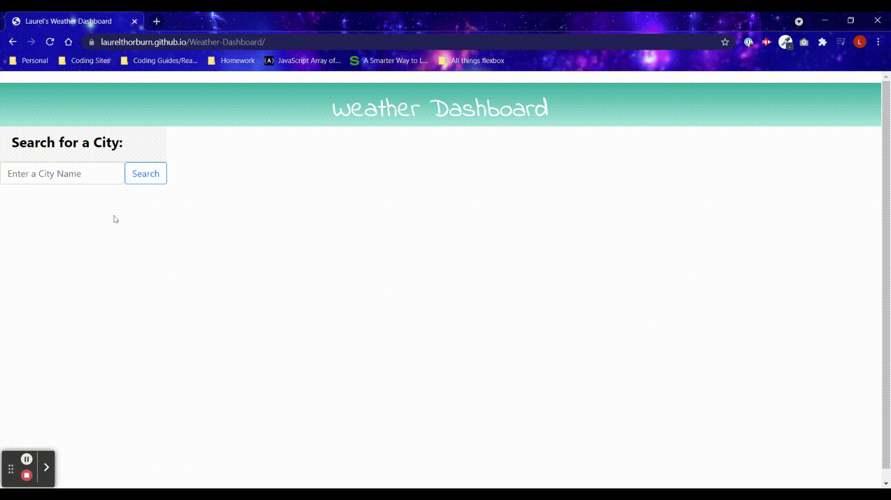

# Weather Dashboard
## Description
The purpose of this project was the create a weather dashboard using a third party API (openweathermap.org).  The user is able to view today's forecast for a city of their choice along with a five day future forecast.  This project utilizes HTML, CSS, JavaScript, jQuery, moment.js, and openweathermap.org's weather data.

# Links

Github: https://github.com/laurelthorburn/Weather-Dashboard

Deployed Site: https://laurelthorburn.github.io/Weather-Dashboard/

## User Story

```
AS A traveler
I WANT to see the weather outlook for multiple cities
SO THAT I can plan a trip accordingly
```

## Acceptance Criteria

```
GIVEN a weather dashboard with form inputs
WHEN I search for a city
THEN I am presented with current and future conditions for that city and that city is added to the search history
WHEN I view current weather conditions for that city
THEN I am presented with the city name, the date, an icon representation of weather conditions, the temperature, the humidity, the wind speed, and the UV index
WHEN I view the UV index
THEN I am presented with a color that indicates whether the conditions are favorable, moderate, or severe
WHEN I view future weather conditions for that city
THEN I am presented with a 5-day forecast that displays the date, an icon representation of weather conditions, the temperature, the wind speed, and the humidity
WHEN I click on a city in the search history
THEN I am again presented with current and future conditions for that city
```
# Technologies:

Languages:
* CSS
* JavaScript
* HTML

Libraries:
* Bootstrap
* jQuery

API/Third Party Sites:
* openweathermap.org
* moment.js

# Website Screenshot



# License
* MIT

# Collaborators

Laurel Thorburn: codinglaurel@gmail.com

# Resources/Credit

* https://www.geeksforgeeks.org/how-to-place-two-bootstrap-cards-next-to-each-other/
* https://developer.mozilla.org/en-US/docs/Learn/JavaScript/Client-side_web_APIs/Third_party_APIs
* https://bithacker.dev/fetch-weather-openweathermap-api-javascript
* https://momentjs.com/
* https://openweathermap.org/api/uvi
* https://www.youtube.com/watch?v=Wxnd21_f_pc&ab_channel=kudvenkat
* https://developer.mozilla.org/en-US/docs/Web/JavaScript/Reference/Global_Objects/JSON/parse
* https://developer.mozilla.org/en-US/docs/Web/JavaScript/Reference/Global_Objects/JSON/stringify
* https://www.sitepoint.com/managing-dates-times-using-moment-js/
